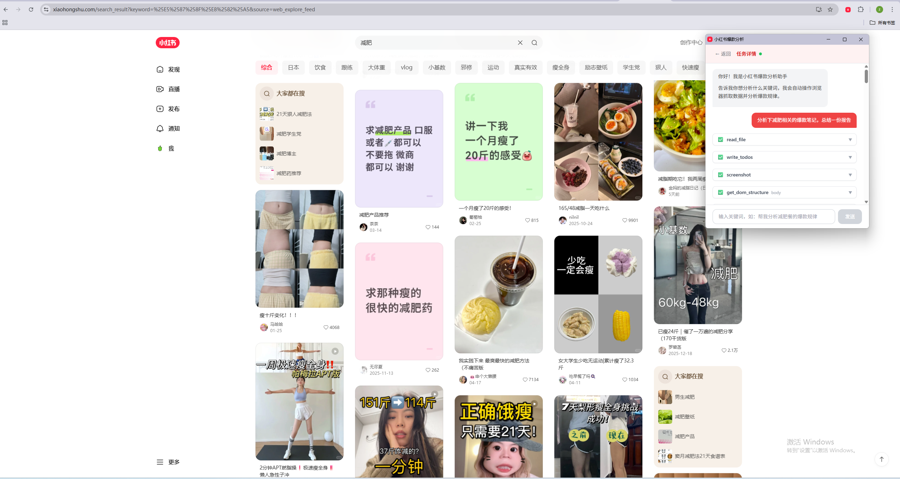
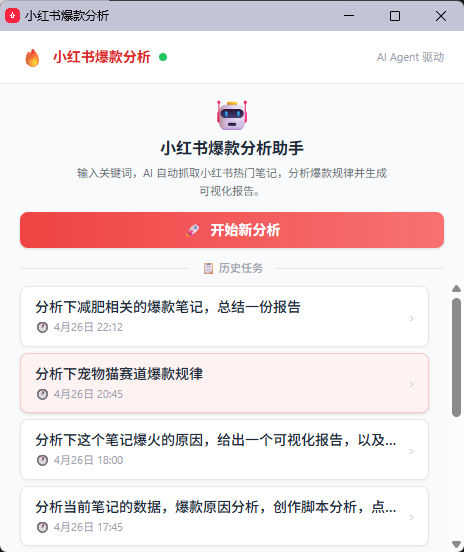
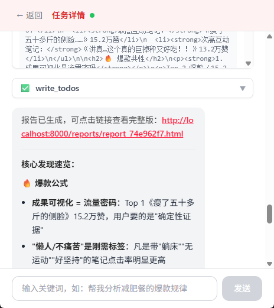
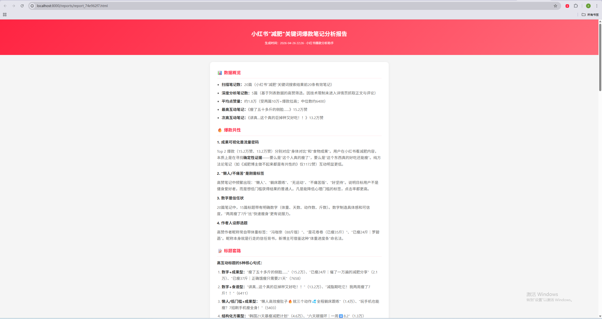

# 小红书爆款分析助手

> 对话式小红书爆款内容分析工具。AI Agent 自动操控浏览器抓取数据、深度分析 Top 笔记内容/评论/视频，输出可视化爆款规律报告。



## 📸 效果展示

| 扩展首页 | 分析过程 | 可视化报告 |
|:---:|:---:|:---:|
|  |  |  |
| 历史任务列表 + 一键开启新分析 | Agent 工具调用过程实时可见 | 自动生成可分享的 HTML 报告 |

## 一、这是什么 & 有什么价值

### 项目是干啥的

一句话：**你输入一个关键词，AI 帮你把小红书上对应话题的爆款内容拆解清楚，并给出 10 个可复制的爆款选题。**

整个项目由两部分组成：

- **Chrome 扩展**：浮动窗口里的对话框，承担"用户输入"和"浏览器操作执行"两个角色
- **Python AI Agent 服务**：基于 Kimi K2（Moonshot）+ LangGraph + DeepAgents 的 Agent，负责思考、决策、调用工具

工作流（以"减肥餐"为例）：

```
用户在扩展里输入"分析减肥餐爆款"
    ↓
Agent 自动打开小红书 → 搜索"减肥餐" → 滚动加载 30~50 篇笔记
    ↓
按互动量挑出 Top 3~5 篇 → 逐篇进入详情页
    ↓
截图记录封面 / 抽帧分析视频 / 提取正文 / 抓取热评
    ↓
从 7 个维度分析爆款规律 → 生成可分享的 HTML 报告
    ↓
返回报告链接，用户点击直接看
```

### 价值在哪里

| 痛点 | 传统做法 | 本工具 |
|---|---|---|
| 想做爆款但不知从哪下手 | 手动翻几十篇笔记记笔记 | Agent 自动抓取并结构化分析 |
| 分析浮于表面 | 只看标题点赞数 | 同时分析封面视觉、正文结构、视频抽帧、评论区真实需求 |
| 选题靠拍脑袋 | 凭感觉编 | 每个选题都标注"依据是 Top X 笔记的 xx 特征 + 评论区 xx 痛点" |
| 结果难分享 | 自己整理 PPT | 自动生成可视化 HTML 报告，直接发链接 |

**适合谁用**：小红书内容创作者、运营、新品牌选题策划、做内容营销的市场人员。

### 与同类工具的区别

- **不依赖小红书官方 API**：通过浏览器扩展模拟真实用户操作，不需要爬虫账号
- **多模态分析**：Agent 能直接"看到"截图和视频画面，不是只分析文字
- **对话式而非表单式**：每次分析都是一次对话，可以追问、修改方向、深挖某一篇
- **完全本地运行**：数据存在本地 SQLite，不需要把账号信息传给第三方

---

## 二、技术文档

### 2.1 整体架构

```
┌────────────────────────────────────────────────────────┐
│  Chrome 扩展（MV3）                                     │
│  ┌──────────┐  ┌─────────────┐  ┌──────────────────┐ │
│  │ Popup UI │  │  Background │  │  Content Script  │ │
│  │ (React)  │◄─┤ Service     ├─►│ (注入到小红书页) │ │
│  │          │  │ Worker      │  │                  │ │
│  └────┬─────┘  └──────┬──────┘  └──────────────────┘ │
└───────┼───────────────┼────────────────────────────────┘
        │ HTTP/SSE      │ WebSocket
        │ (POST chat)   │ (双向 RPC)
        ▼               ▼
┌────────────────────────────────────────────────────────┐
│  Python 后端（FastAPI）                                 │
│  ┌─────────────┐   ┌──────────────────────────────┐   │
│  │  /api/chat  │   │   AI Agent (DeepAgents)       │   │
│  │  Router     ├──►│   - ChatMoonshot (Kimi K2)    │   │
│  │             │   │   - 12 个浏览器工具           │   │
│  │  /api/ws    │◄──┤   - xhs Skill                 │   │
│  │  WebSocket  │   │   - LangGraph Checkpoint     │   │
│  └─────────────┘   └──────────────────────────────┘   │
│  ┌─────────────┐   ┌──────────────────────────────┐   │
│  │  SQLite     │   │   Report Generator           │   │
│  │  - 会话历史 │   │   - Markdown / HTML → 可视化 │   │
│  │  - Agent ckpt│   │   - 静态文件 /reports/* 托管 │   │
│  └─────────────┘   └──────────────────────────────┘   │
└────────────────────────────────────────────────────────┘
```

### 2.2 技术栈

**前端（Chrome 扩展）**

| 组件 | 技术 |
|---|---|
| 框架 | React 18 + TypeScript |
| 构建 | Vite 5 |
| 样式 | TailwindCSS 3 |
| Markdown 渲染 | marked |
| 扩展规范 | Manifest V3 |

**后端（Python 服务）**

| 组件 | 技术 |
|---|---|
| Web 框架 | FastAPI 0.115 + Uvicorn |
| Agent 框架 | DeepAgents 0.5 + LangGraph 1.1 |
| LLM | langchain-moonshot（Kimi K2） |
| Checkpoint | langgraph-checkpoint-sqlite |
| ORM | SQLAlchemy 2.0 |
| 数据库 | SQLite（aiosqlite） |
| 通信 | WebSockets 13 + SSE |

### 2.3 目录结构

```
hot_analysis_plugin/
├── extension/                          # Chrome 扩展
│   ├── manifest.json                   # MV3 清单
│   ├── popup.html                      # 弹窗入口 HTML
│   ├── vite.config.ts                  # 三入口构建（popup/content/background）
│   ├── src/
│   │   ├── popup/
│   │   │   └── App.tsx                 # 对话 UI（首页 + 聊天页）
│   │   ├── background/
│   │   │   └── background.ts           # WebSocket 客户端 + 工具分发 + 心跳
│   │   ├── content/
│   │   │   ├── content.ts              # 注入小红书页执行 click/type/scroll 等
│   │   │   └── videoCapture.ts         # 视频抽帧 / seek 截图
│   │   └── types/
│   │       └── index.ts                # ChatMessage / NoteItem 类型
│   └── icons/                          # 16/48/128 图标
│
├── server/                             # Python 后端
│   ├── requirements.txt
│   ├── app/
│   │   ├── main.py                     # FastAPI 入口、CORS、静态报告目录挂载
│   │   ├── config.py                   # Kimi API key、数据库 URL（读 .env）
│   │   ├── database.py                 # SQLAlchemy engine + Session
│   │   ├── agent/
│   │   │   ├── agent.py                # create_deep_agent + System Prompt + 流式
│   │   │   ├── tools.py                # 12 个 @tool 装饰的浏览器工具
│   │   │   └── ws.py                   # BrowserToolManager + BrowserConnection
│   │   ├── routers/
│   │   │   └── analyze.py              # /api/chat、/api/chat/stream、WebSocket
│   │   ├── services/
│   │   │   └── report.py               # Markdown→可视化 HTML 报告
│   │   └── models/
│   │       └── analyze.py              # Conversation / AnalyzeLog 模型
│   ├── skills/                         # Agent 能加载的 Skill 文件
│   │   └── xhs/
│   │       └── SKILL.md                # 小红书爆款分析的完整执行手册
│   ├── workspace/                      # Agent 文件系统沙箱
│   │   └── reports/                    # 生成的 HTML 报告
│   ├── hot_analysis.db                 # 业务数据
│   └── agent_checkpoints.db            # LangGraph 会话状态持久化
└── README.md
```

### 2.4 通信协议

#### 用户消息 → 后端（HTTP/SSE）

```
POST /api/chat/stream
{
  "conversation_id": "uuid 或 null",
  "client_id": "xhs-ext-xxxxxx",
  "content": "帮我分析减肥餐的爆款规律"
}
```

后端通过 SSE 持续推送事件：

```
data: {"type":"tool_start","id":"call_xxx","tool":"screenshot","params":{}}
data: {"type":"tool_result","id":"call_xxx","tool":"screenshot","result":"data:image/jpeg;base64,..."}
data: {"type":"message","content":"我看到搜索结果页已加载..."}
data: {"type":"done","conversation_id":"uuid"}
```

#### 后端 → 扩展（WebSocket RPC）

```
WS /api/ws/browser/{client_id}

后端发起：
{ "type":"tool_request","request_id":"...","tool":"click","params":{"selector":"#xx"} }

扩展返回：
{ "type":"tool_response","request_id":"...","success":true,"result":"clicked" }
```

应用层心跳：扩展每 30s 发 `{type:"ping"}`，后端立即回 `{type:"pong"}`，超过 45s 没收到 pong 就强制重连。

### 2.5 Agent 工具集

后端定义在 `server/app/agent/tools.py`，所有工具都通过 WebSocket 转发到扩展执行：

| 工具 | 用途 |
|---|---|
| `screenshot` | 截图当前页面（JPEG 压缩 + 缩放到 800px，避免 token 爆炸） |
| `click` | 点击 CSS 选择器对应元素 |
| `hover` | 鼠标悬停（用于触发 hover 才显示的箭头/菜单） |
| `type_text` | 输入文字，可选回车提交 |
| `scroll_page` | 滚动页面或指定容器 |
| `scroll_to_element` | 平滑滚动到元素居中 |
| `get_page_content` | 提取页面文本内容 |
| `get_dom_structure` | 输出 DOM 树（操作前先看 DOM） |
| `find_element_by_text` | 通过关键词查找元素，返回选择器 |
| `extract_video_frames` | 视频均匀抽帧（多模态返回图片列表） |
| `capture_video_snapshot` | 视频指定时间点 seek 截图（无漂移） |
| `generate_report` | Markdown/HTML → 可视化报告并返回 URL |

每个工具内部都有 `try-except` 兜底，**底层报错会作为字符串返回给 Agent**，不会中断主流程，让 Agent 自己决定换选择器还是换思路。

### 2.6 核心设计点

**1. Agent 韧性执行**

System Prompt 明确要求："工具报错时换选择器或换方法继续，绝不中断任务"。配合工具层的 `_safe_exec` 包装，整个链路对 DOM 变化容错。

**2. 多模态感知**

`screenshot` / `extract_video_frames` / `capture_video_snapshot` 都返回 `[{type:"image_url", image_url:{url:...}}]` 多模态格式，Kimi K2 能直接"看到"页面，决策更准确。

**3. Skill 加载机制**

`create_deep_agent(skills=["/skills/"])` + `CompositeBackend` 把 `server/skills/` 挂载为 Agent 的虚拟文件系统，Agent 按需用 `read_file` 加载 `xhs/SKILL.md`，避免 System Prompt 过长。

**4. 会话状态持久化**

`AsyncSqliteSaver` 把 LangGraph 的完整 state（包括思考过程、工具调用历史）持久化到 `agent_checkpoints.db`，前端只需传 `conversation_id`，后端自动续接上下文。

**5. 浮动窗口而非默认 Popup**

默认 Chrome popup 一失焦就关，长任务体验差。用 `chrome.windows.create({type:"popup"})` 创建独立窗口（480×560），并锁定尺寸，避免误调整。

**6. Service Worker 保活**

MV3 Service Worker 30s 不活跃就会休眠，导致 WebSocket 断连。通过 `chrome.alarms` 30s 心跳 + content script 20s `keepalive` 双重保活。

### 2.7 数据模型

**Conversation**（业务对话表，`server/hot_analysis.db`）

| 字段 | 类型 | 说明 |
|---|---|---|
| id | str (UUID) | 主键 |
| user_id | str | 客户端 ID（`xhs-ext-xxxxxx`） |
| title | str | 自动用首条消息前 50 字 |
| messages_json | TEXT | 完整对话历史（含 tool 消息） |
| created_at / updated_at | datetime | 时间戳 |

**AnalyzeLog**（分析任务日志）：每次 chat 落一条，记录耗时和关键词。

**LangGraph Checkpoint**（`agent_checkpoints.db`）：由 LangGraph 自管，保存 Agent 中间状态。

---

## 三、使用方法

### 3.1 环境要求

- Node.js ≥ 18（构建扩展）
- Python ≥ 3.10（运行后端）
- Chrome 或基于 Chromium 的浏览器（Edge、Brave 等）
- Kimi（Moonshot）API Key

### 3.2 启动后端

```bash
cd server

# 1. 装依赖
pip install -r requirements.txt

# 2. 配置 .env
cat > .env <<EOF
KIMI_API_KEY=sk-你的-kimi-api-key
KIMI_BASE_URL=https://api.kimi.com/coding/v1
KIMI_MODEL=kimi-k2-0711
DATABASE_URL=sqlite:///./hot_analysis.db
EOF

# 3. 启动服务（默认 8000 端口）
uvicorn app.main:app --reload --port 8000
```

启动成功后访问 http://localhost:8000 应该返回：
```json
{"message": "小红书爆款分析 API 运行中"}
```

### 3.3 构建并安装扩展

```bash
cd extension

# 1. 装依赖
npm install

# 2. 构建（产物在 extension/dist）
npm run build
# 或开发模式：npm run watch
```

**加载到浏览器**：

1. 打开 `chrome://extensions/`
2. 右上角打开"开发者模式"
3. 点击"加载已解压的扩展程序"
4. 选择 `extension/dist` 目录
5. 浏览器工具栏出现 🔥 图标即安装成功

### 3.4 开始分析

1. **打开小红书**：在浏览器里访问 https://www.xiaohongshu.com/ 并登录
2. **打开扩展**：点击工具栏的 🔥 图标，弹出独立浮动窗口
3. **检查连接**：右上角圆点变绿表示后端已连接（变灰说明后端没启动）
4. **开始新分析**：点击"🚀 开始新分析"
5. **输入关键词**：例如：
   - `帮我分析减肥餐的爆款规律`
   - `分析小户型装修的爆款笔记`
   - `想做母婴用品种草，给我找下选题方向`
6. **看 Agent 干活**：界面会实时显示 Agent 的工具调用（点哪里、看什么、抓到什么），点击工具卡片可展开看详情
7. **拿报告**：分析完成后，Agent 会回复一段总结 + 一个 HTML 报告链接，点击在新标签页查看完整可视化报告

### 3.5 常见问题

**Q：扩展显示"未连接到后端"**

- 确认 `uvicorn` 还在跑，且端口是 8000
- 把 popup 关掉重开一次，或点"开始新分析"会触发自动重连
- 检查 8000 端口没被占用、防火墙没拦

**Q：Agent 一直在重复同一个操作**

- 通常是页面没加载完，让 Agent 自己 `screenshot` 看一眼就好
- 在对话里手动提示一句"先截图看看现在页面状态"
- 如果是小红书改版导致选择器失效，编辑 `server/skills/xhs/SKILL.md` 更新选择器提示

**Q：截图返回的图很糊**

故意压缩的（800px 宽 + JPEG quality 0.5）。这是为了控制多模态 token 消耗，文字识别仍然够用。要原图请改 `extension/src/background/background.ts` 里 `scale` 和 `quality` 参数。

**Q：报告里数据不全**

- 用 `npm run watch` 边开发边看 Console 日志定位卡在哪一步
- 看 `server` 控制台日志查 Agent 调用工具的轨迹
- 数据少（笔记 < 10 篇 / 深度素材 < 3 篇）时，Skill 已经会让 Agent 提醒"建议补充抓取"

**Q：想分析其他平台（抖音、B 站等）**

复制 `server/skills/xhs/` 改名为 `server/skills/douyin/`，重写 `SKILL.md` 里的搜索框选择器、列表抽取逻辑等，再修改 `extension/manifest.json` 里 `host_permissions` 和 `content_scripts.matches`，重新 build 扩展即可。

### 3.6 开发调试

| 调试需求 | 方法 |
|---|---|
| 看后端日志 | uvicorn 启动的终端窗口 |
| 看 Agent 工具调用 | 后端日志 + popup 里展开 tool 卡片 |
| 看 background 日志 | `chrome://extensions/` → 扩展卡片"Service Worker"链接 |
| 看 content script 日志 | 在小红书页面打开 DevTools → Console |
| 看 popup 日志 | 在浮动窗口右键检查 |
| 重置会话 | 删除 `server/agent_checkpoints.db*` 三个文件 |
| 清空业务数据 | 删除 `server/hot_analysis.db` |

---

## 四、License

仅供学习研究使用。请遵守小红书的服务条款和 robots 协议，不要用于大规模数据抓取或商业违规用途。
